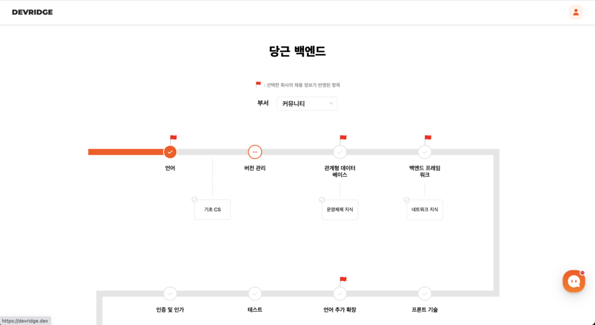

# DEVRIDGE
## Live

Link: [https://devridge.dev](https://devridge.dev/)  
Repository: [https://github.com/DEVRIDGE/devridge-api](https://github.com/DEVRIDGE/devridge-api)



## 개요

DEVRIDGE는 취업 준비생들이 다양한 채용 정보 플랫폼에서 필요한 기술을 빠르고 효율적으로 파악하고 준비할 수 있도록 도와주는 서비스입니다. 

채용 정보를 기반으로 맞춤형 학습 로드맵을 제공하며, 필요한 강의 및 학습 자료를 추천하여 취업 준비 및 직무 전환에 실질적인 도움을 제공합니다.

## 주요 기능

- **채용 정보 기반 학습 로드맵**: 관심 있는 회사나 직무에 필요한 기술을 학습하기 위한 맞춤형 로드맵을 제공합니다.

- **학습 자료 추천**: 로드맵에 따른 무료 강의와 도서 정보를 제공하여 효율적인 학습을 지원합니다.

- **학습 진행 상태 추적**: 개인의 학습 진행 상황을 확인하고, 로드맵의 완성도에 따라 지속적인 성장을 도모할 수 있습니다.

## 기술 스택

### 프론트엔드

HTML5, CSS3, Javascript, Typescript, React.JS

### 백엔드

Java, Spring, JPA, Mysql, Python, Selenium

### 프로젝트 관리

Git, Github, Jira, Docker, nGrinder

## 빌드 및 실행 방법

백엔드 API와 관련된 빌드 및 실행방법 입니다.

### 시스템 요구사항

프로젝트를 설치하고 실행하기 전에 시스템에 다음 소프트웨어가 설치되어 있는지 확인하세요.

```
Java 11
```

### 빌드 및 실행

```
sh start.sh
```

## 프로젝트 멤버

<table>
  <th align="center">프론트엔드</th>
  <th align="center">백엔드</th>
  <th align="center">백엔드</th>
  <tr>
    <td align="center"></td>
    <td align="center"></td>
    <td align="center"></td>
  </tr>
  <tr>
    <td align="center"><a href="https://github.com/minsu-cnu">배민수</a></td>
    <td align="center"><a href="https://github.com/woosungkim0123">김우성</a></td>
    <td align="center"><a href="https://github.com/boulce">송하빈</a></td>
  </tr>
</table>

## 릴리즈 노트

### Version 1.0.0 (2023. 9. 19)

- 구글 로그인 기능 추가
- 회사별 맞춤 채용 정보에 기반한 로드맵 제공.
- 학습 주제에 적합한 영상 정보 제공.
- 사용자 권한에 따른 정보 제공 차별화 기능 도입.

### Version 1.0.1 (2023. 10. 4)

- 관리자 서비스 추가(코스 관리, 채용 정보 간편 등록, 영상 관리)
  
### Version 1.1.0 (2023. 10. 12)

- 채널톡을 통한 설문조사 및 고객응대 기능 도입

### Version 2.0.0 (2023. 10. 27)

- 시스템 설계 변경 및 개편 (중복 데이터 문제 해결)

### Version 2.1.0 (2023. 11. 1)

- 영상 '좋아요' 기능 추가.
- 학습 상태 변경 로직 추가.
- 책 정보 제공 기능 추가.
- 기술 설명 추가

### Version 2.1.1 (2023. 11. 14)

- 관리자 페이지 개편 및 채용공고 등록 자동화.